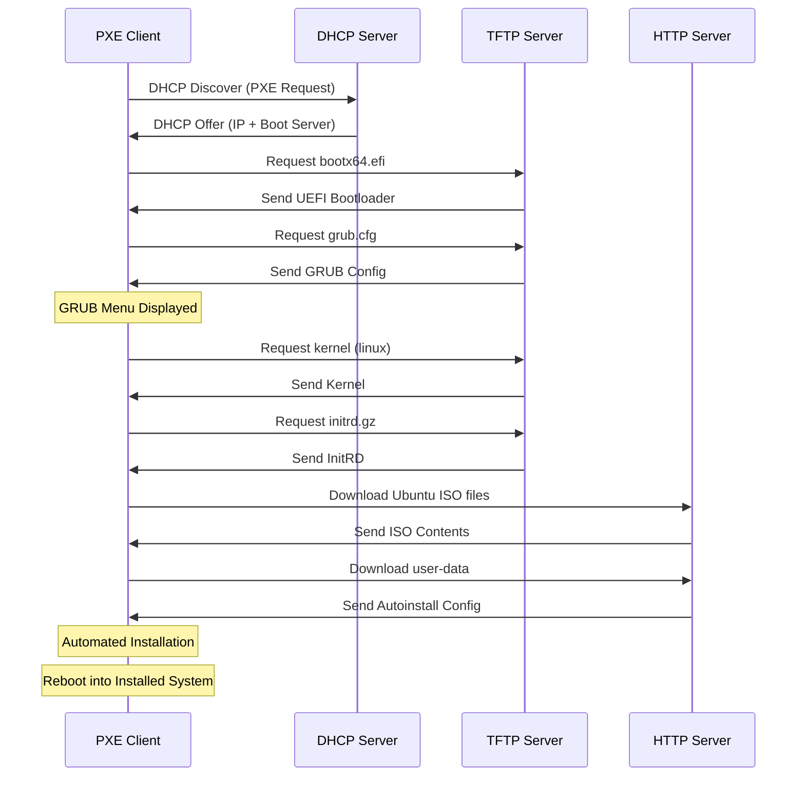

# Ubuntu 24 Network Boot Setup (UEFI + Autoinstall)

Автоматическая настройка PXE сервера для сетевой установки Ubuntu 24.04 с использованием UEFI, HTTP-репозитория и автоматической установки через cloud-init.

## Описание

Проект создает инфраструктуру для сетевой загрузки и автоматической установки Ubuntu 24.04:

- **PXE Server** - сервер с DHCP, TFTP и HTTP для обслуживания сетевой загрузки
- **PXE Client** - тестовая машина для проверки автоматической установки
- **UEFI Boot** - поддержка UEFI загрузки через GRUB
- **Autoinstall** - автоматическая установка через cloud-init (user-data)
- **HTTP Repository** - установка из HTTP-репозитория

## Структура проекта

```
DHCP_PXE/
├── Vagrantfile                           # Конфигурация VM
├── provision.yml                         # Ansible playbook
└── roles/
    └── pxe_server/                       # Ansible роль
        ├── defaults/
        │   └── main.yml                  # Переменные по умолчанию
        ├── handlers/
        │   └── main.yml                  # Обработчики для перезапуска сервисов
        ├── tasks/
        │   ├── main.yml                  # Главный файл задач
        │   ├── dhcp.yml                  # Настройка DHCP
        │   ├── tftp.yml                  # Настройка TFTP
        │   ├── http.yml                  # Настройка HTTP (Nginx)
        │   └── autoinstall.yml           # Создание autoinstall конфигурации
        └── templates/
            ├── dhcpd.conf.j2             # Конфигурация DHCP сервера
            ├── grub.cfg.j2               # GRUB меню загрузки
            ├── nginx-pxe.conf.j2         # Конфигурация Nginx
            └── user-data.j2              # Cloud-init autoinstall
```

## Требования

- **VirtualBox** 6.0+
- **Vagrant** 2.2+
- **Ansible** 2.9+
- Минимум 4GB свободной RAM
- Минимум 10GB свободного места на диске

## Быстрый старт

### 1. Запуск PXE сервера

```bash
cd /home/alex/otus-homework/DHCP_PXE
vagrant up pxeserver
```

Ansible автоматически настроит:
- DHCP сервер (ISC DHCP)
- TFTP сервер для UEFI boot файлов
- Nginx для HTTP репозитория
- Скачает Ubuntu 24.04 ISO (~2GB)
- Создаст autoinstall конфигурацию

### 2. Проверка сервисов

```bash
# Проверить DHCP
vagrant ssh pxeserver -c "sudo systemctl status isc-dhcp-server"

# Проверить TFTP
vagrant ssh pxeserver -c "sudo systemctl status tftpd-hpa"

# Проверить Nginx
vagrant ssh pxeserver -c "sudo systemctl status nginx"

# Проверить доступность репозитория
vagrant ssh pxeserver -c "curl -I http://localhost/ubuntu/"

# Проверить autoinstall файлы
vagrant ssh pxeserver -c "curl http://localhost/autoinstall/user-data"
```

### 3. Тестирование сетевой загрузки

```bash
# Запустить клиентскую VM
vagrant up pxeclient
```

**Важно:** Откройте VirtualBox Manager UI и наблюдайте за процессом загрузки в консоли `pxeclient`.

Ожидаемый процесс:
1. VM загружается по сети (UEFI PXE)
2. DHCP назначает IP адрес
3. TFTP загружает GRUB bootloader
4. Отображается GRUB меню с опциями установки
5. Выбирается "Ubuntu 24.04 Autoinstall" (автоматически через 10 сек)
6. Загружаются ядро и initrd через HTTP
7. Начинается автоматическая установка
8. Установка завершается и система перезагружается

⏱️ **Время установки:** 10-15 минут

### 4. Проверка установленной системы

После завершения установки и перезагрузки:

```bash
# Войти в установленную систему
vagrant ssh pxeclient

# Учетные данные (установлены в user-data):
# Логин: ubuntu
# Пароль: ubuntu
```

## Конфигурация

Основные параметры находятся в `roles/pxe_server/defaults/main.yml`:

### Сеть

```yaml
pxe_network: "192.168.50.0"
pxe_server_ip: "192.168.50.10"
dhcp_range_start: "192.168.50.100"
dhcp_range_end: "192.168.50.200"
```

### Ubuntu

```yaml
ubuntu_version: "24.04"
ubuntu_iso_url: "https://releases.ubuntu.com/24.04/ubuntu-24.04-live-server-amd64.iso"
```

### Autoinstall

```yaml
autoinstall_user: "ubuntu"
autoinstall_password: "ubuntu"  # Будет захеширован
autoinstall_hostname: "ubuntu-client"
```

## Архитектура

### Сетевая схема

```
┌─────────────────┐          ┌─────────────────┐
│   PXE Server    │          │   PXE Client    │
│  192.168.50.10  │◄────────►│  DHCP (50.100+) │
│                 │          │                 │
│ • DHCP Server   │          │ • UEFI Boot     │
│ • TFTP Server   │          │ • Network Boot  │
│ • HTTP Server   │          │                 │
└─────────────────┘          └─────────────────┘
        │
        │ Internal Network: pxenet (192.168.50.0/24)
        │
```

### Процесс загрузки



## Особенности реализации

### UEFI Boot

- Используется **shimx64.efi** (Secure Boot shim)
- Загрузчик **grubnetx64.efi** для GRUB2
- Поддержка различных архитектур через DHCP option 93

### Autoinstall

- Использует **cloud-init** формат
- LVM разметка диска
- Автоматическое создание пользователя
- SSH сервер включен по умолчанию
- sudo права без пароля

### HTTP Repository

- Ubuntu ISO монтируется и копируется в `/var/www/html/ubuntu`
- Nginx обслуживает файлы репозитория
- Autoinstall файлы в `/var/www/html/autoinstall`

## Troubleshooting

### DHCP не запускается

```bash
vagrant ssh pxeserver -c "sudo journalctl -u isc-dhcp-server -n 50"
```

Проверьте интерфейс в `/etc/default/isc-dhcp-server`

### TFTP файлы не загружаются

```bash
# Проверить наличие файлов
vagrant ssh pxeserver -c "ls -lah /var/lib/tftpboot/"

# Проверить логи TFTP
vagrant ssh pxeserver -c "sudo journalctl -u tftpd-hpa -n 50"
```

### Client не загружается по сети

1. Убедитесь что UEFI включен в настройках VM
2. Проверьте порядок загрузки (Network должна быть первой)
3. Проверьте, что обе VM в одной сети `pxenet`

### Ошибка при скачивании ISO

ISO файл большой (~2GB), может потребоваться время и стабильное соединение:

```bash
# Проверить статус загрузки
vagrant ssh pxeserver -c "ls -lh /opt/ubuntu-24.04-live-server-amd64.iso"
```

## Очистка

```bash
# Остановить и удалить VM
vagrant destroy -f

# Удалить диск клиента
rm -f pxeclient-disk.vdi
```

## Кастомизация

### Изменить autoinstall конфигурацию

Отредактируйте `roles/pxe_server/templates/user-data.j2`:

```yaml
# Добавить пакеты
packages:
  - vim
  - curl
  - htop
  - docker.io

# Изменить разметку диска
storage:
  layout:
    name: direct  # вместо lvm
```

Затем перепровизионируйте:

```bash
vagrant provision pxeserver
```

### Использовать другую версию Ubuntu

В `roles/pxe_server/defaults/main.yml`:

```yaml
ubuntu_version: "22.04"
ubuntu_codename: "jammy"
ubuntu_iso_url: "https://releases.ubuntu.com/22.04/ubuntu-22.04-live-server-amd64.iso"
```

## Ссылки

- [Ubuntu Autoinstall Documentation](https://ubuntu.com/server/docs/install/autoinstall)
- [Cloud-init Documentation](https://cloudinit.readthedocs.io/)
- [GRUB Network Boot](https://www.gnu.org/software/grub/manual/grub/html_node/Network.html)
- [ISC DHCP Server](https://www.isc.org/dhcp/)

## Лицензия

MIT

## Автор

Created for OTUS homework assignment
