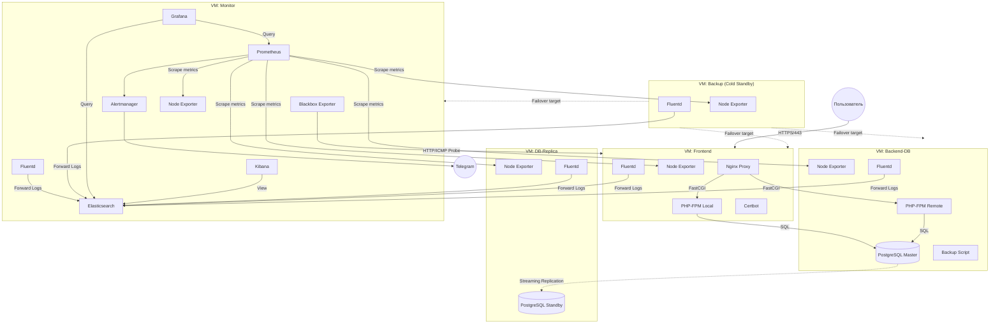

# LibreSpeed High-Availability Infrastructure

Этот проект представляет собой автоматизированное развертывание сервиса LibreSpeed (Speedtest) с высокой доступностью (High Availability), отказоустойчивостью и полным стеком мониторинга и логирования на базе Yandex Cloud.

## Архитектура системы



Инфраструктура разворачивается с помощью **Terraform** и настраивается через **Ansible**. Она состоит из следующих логических узлов:

1.  **Frontend (Web/Proxy / Local Backend)**
    *   **Nginx:** Принимает входящий трафик по HTTP/HTTPS (443/80), балансирует нагрузку и отдает статику.
    *   **Certbot:** Автоматический выпуск SSL сертификатов Let's Encrypt.
    *   **PHP-FPM (Local):** Локальный backend для LibreSpeed для распределения нагрузки.
2.  **Backend & DB Primary**
    *   **PostgreSQL (Master):** Основная база данных для хранения результатов тестирования (схема telemetry).
    *   **PHP-FPM (Remote):** Основной backend серсис для обработки результатов.
3.  **DB Replica**
    *   **PostgreSQL (Standby):** Read-only реплика базы данных (физическая потоковая репликация из Primary). Обеспечивает отказоустойчивость данных.
4.  **Стек мониторинга (Monitor)**
    *   **Prometheus:** Сбор метрик со всех узлов.
    *   **Node Exporter:** Системные метрики на каждом сервере.
    *   **Blackbox Exporter:** Внешний мониторинг доступности ендпоинтов (HTTP/HTTPS пинги).
    *   **Grafana:** Дашборды для визуализации даных (логи и метрики).
    *   **Alertmanager:** Отправка оповещений (например, в Telegram) об отказах.
    *   **EFK стег (Elasticsearch + Kibana):** Централизованное хранилище и просмотрщиков логов (Nginx). Передача логов осуществляется с узлов через **Fluentd**.
5.  **Резервный узел (Backup)**
    *   Узел в режиме ожидания (Cold Standby), готовый взять на себя роль вышедшего из строя компонента системы с помощью failover-скриптов.

---

## Порядок развертывания проекта

### Шаг 1. Инфраструктура (Terraform)
В первую очередь необходимо развернуть виртуальные машины и сетевую инфраструктуру в Yandex Cloud.

```bash
cd terraform
# Подготовка и авторизация (заполнить terraform.tfvars требуемыми токенами)
terraform init
terraform plan
terraform apply
terraform apply -replace='yandex_compute_instance.vm["backup"]'

```

### Шаг 2. Конфигурация серверов (Ansible)
После выдачи IP-адресов Terraform, они автоматически применяются к конфигурации Ansible. Запуск главного плейбука устанавливает все компоненты:

```bash
cd ../ansible
ansible-playbook playbooks/site.yml --ask-vault-pass
```

Развертывание происходит в следующем строгом порядке (описан в `site.yml`):
1.  **Base configuration:** Настройка пользователей, файрвола, node_exporter и базовых пакетов (`apt`).
2.  **Backend & DB:** Установка Master PostgreSQL (включая создание БД) и PHP backend-сервера.
3.  **Monitoring:** Развертывание логов (EFK) и метрик (Prometheus/Grafana). Зависит от БД для создания БД под Grafana.
4.  **DB Replica:** Настройка standby-сервера PostgreSQL.
5.  **Frontend:** Настройка Nginx, получение SSL (Certbot) и сборщик Fluentd-логов.

---

## Развертывание узлов на резервной машине (Failover)

Если один из основных серверов (например, Фронтенд, База данных или Мониторинг) выходит из строя, предусмотрены скрипты автоматического перевода резервного сервера (Backup) в этот режим.

Все резервные плейбуки находятся в директории `ansible/playbooks/`.

### Замещение упавшего Frontend узла
При выходе из строя внешнего фронтенда:
```bash
ansible-playbook playbooks/failover-to-frontend.yml --ask-vault-pass

ansible-playbook playbooks/site.yml --tags prometheus -e "domain_name=xn--b1afah7bd.xn----ctbkoedricefmgyd0k.xn--p1ai" --ask-vault-pass

```
*После выполнения измените DNS A-записи в вашем домене, чтобы они указывали на публичный IP резервной машины.*

### Замещение упавшего Backend-DB узла
При отказе основной базы данных резервная машина конфигурируется как Master, восстанавливая последний актуальный бекап или пересоздавая роль:
```bash
ansible-playbook playbooks/failover-to-db-primary.yml --ask-vault-pass
```
ansible-playbook playbooks/failover-to-db-replica.yml --ask-vault-pass

### Замещение упавшего Monitor узла
Восстанавливает работу стека мониторинга на запасном сервере:
```bash
ansible-playbook playbooks/failover-to-monitor.yml --ask-vault-pass
```

---

## Команды для проверки работоспособности системы

Ниже представлены команды, которые можно использовать для ручного аудита работоспособности конкретных узлов.

### Проверка Frontend (Nginx & SSL)
**Проверка сертификата и ответа сервера (выполнять локально):**
```bash
curl -I https://xn----ctbkoedricefmgyd0k.xn--p1ai
curl -I https://www.xn----ctbkoedricefmgyd0k.xn--p1ai
```
*(Ожидаемый результат: `HTTP/2 200`)*

**Проверка конфигурации на самом frontend сервере:**
```bash
sudo nginx -t
sudo systemctl status nginx
sudo systemctl status certbot.timer
```

### Проверка базы данных (PostgreSQL)
**Проверка состояния Active БД (backend-db):**
```bash
sudo systemctl status postgresql
# Убедиться, что таблицы LibreSpeed созданы:
sudo -u postgres psql -d speedtest -c "\dt"
sudo -u postgres psql -d speedtest -c "SELECT id, timestamp, ip, dl, ul, ping FROM speedtest_users ORDER BY timestamp DESC LIMIT 10;"

```

**Проверка логической/физической репликации (на db-replica):**
```bash
sudo systemctl status postgresql
# Если сервер работает в режиме реплики, он вернет 't' (true)
sudo -u postgres psql -c "SELECT pg_is_in_recovery();"
```

### Проверка Мониторинга (Prometheus, Grafana)
Доступ к сервисам может быть проверен по портам (если они открыты файрволом) или через проверки статуса демона на узле мониторинга (`monitor`):
```bash
# Статус сборщиков
sudo systemctl status prometheus
sudo systemctl status grafana-server
sudo systemctl status alertmanager
```
**Проверка UI интерфейсов:**
* Grafana: `http://178.154.244.251:3000` (Учетные данные Ansible)
* Prometheus: `http://178.154.244.251:9090`
* Kibana: `http://178.154.244.251:5601`

### Проверка логирования (EFK Stack)
**На мониторинг узле (Elastic/Kibana):**
```bash
# Работает ли база данных логов Elasticsearch
curl -X GET "localhost:9200/_cluster/health"
# Доступность Kibana интерфейса
sudo systemctl status kibana
```
**На фронтенде (Генерация логов):**
Отправка логов в Elastic идет через Fluentd:
```bash
sudo systemctl status td-agent
tail -f /var/log/td-agent/td-agent.log
```
