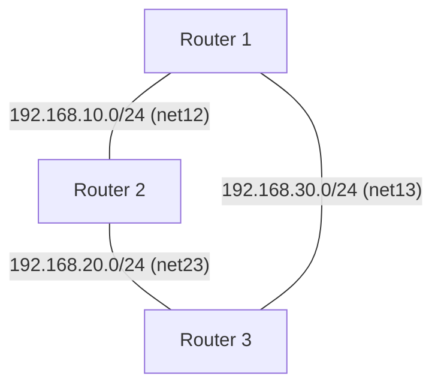

# Настройка OSPFv2 в сети из 3 виртуальных машин с помощью FRR и Ansible

## Задание
В учебных целях создана сеть из 3 виртуальных машин (Vagrant), настроена сеть (протокол OSPFv2) с помощью Ansible и FRR.

**Условия выполнения:**
1. Развернуты 3 виртуальные машины.
2. Машины объединены разными vlan (интерфейсами).
3. Настроен OSPF между машинами на базе FRR.
4. Реализован ассиметричный роутинг.
5. Один из линков сделан "дорогим", при этом роутинг настроен симметрично.

## Схема сети

- **Router 1 ID:** 1.1.1.1
- **Router 2 ID:** 2.2.2.2
- **Router 3 ID:** 3.3.3.3

## Особенности проектирования и реализации

### Инфраструктура
- Использован **Vagrant** для развертывания 3 ВМ на базе `bento/ubuntu-20.04`.
- Сеть организована в виде треугольника с использованием внутренних сетей VirtualBox (`virtualbox__intnet`).

### Настройка (Ansible)
- Для настройки использован **Ansible**.
- Установлен и настроен пакет **FRR**.
- Включена пересылка IP-пакетов (`net.ipv4.ip_forward`).
- Конфигурация OSPF выполнена через шаблоны `frr.conf.j2` и `daemons.j2`.
- OSPF настроен прямо на интерфейсах (`ip ospf area 0`), что упрощает конфигурацию и избавляет от необходимости вычислять сети.

### Сценарии маршрутизации

#### Ассиметричный роутинг
Для демонстрации ассиметричного роутинга стоимость прямого линка между R1 и R3 была установлена разной в разных направлениях:
- На **R1-eth2** (к R3) cost = **100**.
- На **R3-eth1** (к R1) cost = **10**.

В результате трафик от R1 к R3 идет через R2 (10+10=20 < 100).
Трафик от R3 к R1 идет напрямую (10 < 20).

#### Симметричный роутинг через "дорогой" линк
Для того чтобы сделать линк дорогим, но сохранить симметрию, стоимость линка была повышена до **100** на ОБОИХ концах (R1 и R3).
Теперь и R1, и R3 предпочитают путь через R2 (суммарная стоимость 20 против прямой стоимости 100), что делает маршрутизацию симметричной через промежуточный узел.

## Проверка связности
Связность проверена с помощью команд:
- `ping` (базовая проверка).
- `ip route get <IP>` (проверка выбранного пути).
- `vtysh -c "show ip ospf route"` (проверка таблицы маршрутов OSPF).
