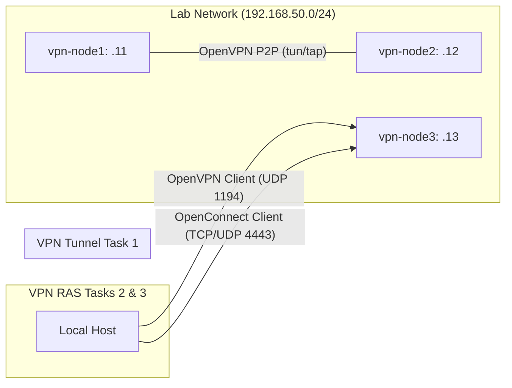

# Лабораторная работа: Настройка VPN (Vagrant + Ansible)

## Название задания
Развертывание и настройка различных типов VPN-туннелей: OpenVPN (P2P и RAS) и ocserv.

## Текст задания
1. Настроить VPN между двумя ВМ в tun/tap режимах, замерить скорость в тунлелях (iperf3), сделать вывод об отличающихся показателях;
2. Поднять RAS на базе OpenVPN с клиентскими сертификатами, подключиться с локальной машины на ВМ;
3. Настроить ocserv, подключиться с хоста к ВМ.
4. Написать документацию.

## Схема сети

## Особенности проектирования и реализации решения

### Task 1: OpenVPN P2P (tun vs tap)
- **Реализация**: На `vpn-node1` и `vpn-node2` установлены OpenVPN. Используется статический ключ (`static.key`) для упрощения. Поднято два инстанса: `tun` (порт 1194) и `tap` (порт 1195).
- **Сравнение скорости (ожидаемое)**:
    - **tun (L3)**: Работает быстрее и имеет меньший оверхед, так как передает только IP-пакеты.
    - **tap (L2)**: Передает Ethernet-фреймы, что дает больший оверхед (заголовки L2), но позволяет передавать не-IP трафик и работать в режиме моста (bridge).
    - *Ожидаемый вывод*: `tun` показывает чуть более высокую пропускную способность и меньшие задержки.

### Task 2: OpenVPN RAS
- **Реализация**: На `vpn-node3` настроен сервер с использованием PKI (Easy-RSA).
- **Безопасность**: Используются клиентские сертификаты. Настроен TLS-auth (`ta.key`) для защиты от DoS и сканирования портов.
- **Маршрутизация**: Сервер пушит маршрут по умолчанию и DNS-серверы клиентам.

### Task 3: ocserv (OpenConnect / AnyConnect)
- **Реализация**: Альтернативный VPN-сервер, совместимый с протоколом Cisco AnyConnect.
- **Особенности**: Работает преимущественно через HTTPS (TCP 4443 в данной лабе) и использует DTLS (UDP) для ускорения трафика. В данной реализации используется парольная аутентификация через `ocpasswd`.

